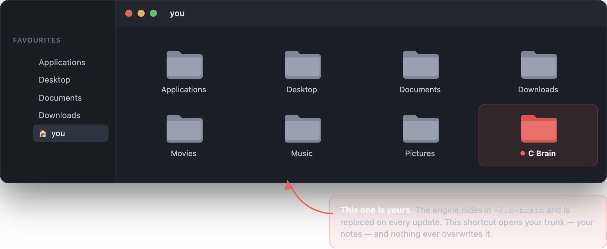
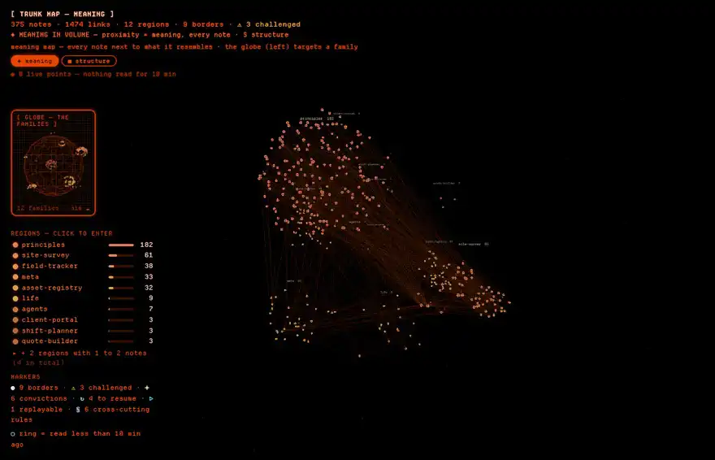
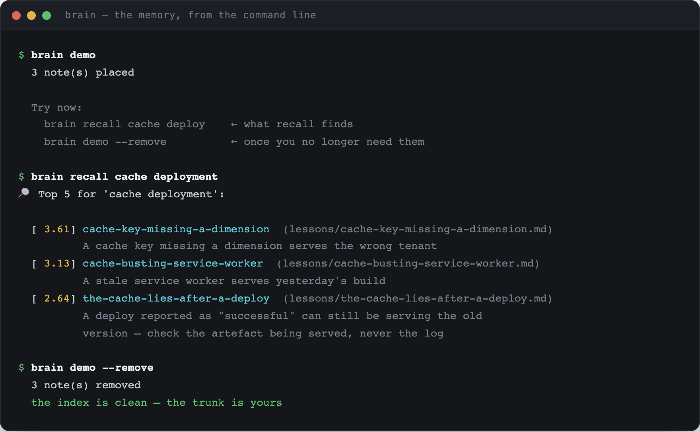

# C Brain

[](https://github.com/Yuno15-bb/c-brain/actions/workflows/ci.yml)
[](https://github.com/Yuno15-bb/c-brain/releases/latest)
[](LICENSE)
[](#compatibility)

**C Brain turns each session with your CLI agent into memory it can reuse —
distilled into a note, filed, linked, and handed back automatically the next
time it matters. From any project, and without leaving your machine.**

Your agent is brilliant within a session and amnesic between two. Solve
something on Monday, explain it again on Thursday. C Brain is the part that
remembers.

The more work piles up, the more useful the tree gets — the opposite of a
conversation history, which only gets longer.

---

## What it actually does

**The memory itself** — this is the product, and it is all you need:

| | |
|---|---|
| 🌳 **A trunk** | your lessons, projects, method — markdown, on your machine, versionable |
| 🔎 **Automatic recall** | relevant notes are injected into context on every prompt |
| 🤖 **8 agents** | they distill, file, link, challenge, synthesize, prune, repair, and watch the machine |
| 🔁 **A closed loop** | session ends → archive → distill → file, without being asked |
| ⬆️ **Updates** | the engine updates itself; **your notes are never touched** |

**And two ways to look at it**, which are extensions and install separately —
`./install.sh --core-only` leaves both out:

| | |
|---|---|
| 🔮 **A capsule** | a glass orb on your desktop showing the agents at work, live |
| 🪐 **A planet** | your knowledge as a navigable 3D globe, rebuilt on every launch |

### How good is the recall?

Measured, not asserted — `tests/recall_benchmark.py`, on a synthetic corpus
where finding the answer means picking one note out of ~120 that share its
subject and most of its vocabulary:

| notes | P@1 | P@3 | MRR | off-topic in what it injects | per prompt |
|---|---|---|---|---|---|
| 100 | 0.94 | 0.98 | 0.96 | 35% | 5 ms |
| 1000 | 0.79 | 0.93 | 0.86 | 24% | 47 ms |
| 5000 | 0.46 | 0.83 | 0.64 | 39% | — |

It holds to about a thousand notes and degrades sharply past that. Published
here because a memory tool that will not say how well it remembers is asking
for trust it has not earned. The CI enforces these numbers as thresholds.

## Install

**As a Claude Code plugin** — the short way, and the one that updates itself:

```
/plugin marketplace add Yuno15-bb/c-brain
/plugin install c-brain@c-brain
```

That gives you the whole memory: the trunk, automatic recall, the eight agents,
the `brain` command, and three commands you can type — `/c-brain:recall`,
`/c-brain:distill`, `/c-brain:doctor`. It creates `~/.c-brain/trunk` on your first session and
tells you so. It does **not** set up the capsule, the planet or the scheduled
jobs — a plugin cannot install a background service, and pretending otherwise
would leave you with a window that never opens.

**The full install** — everything above, plus the capsule, the planet and the
unattended maintenance:

```
Install C Brain: clone https://github.com/Yuno15-bb/c-brain into ~/dev/c-brain, read its INSTALL.md,
then run ./install.sh and show me the final verification output.
```

Or by hand: `git clone … && cd c-brain && ./install.sh`

**The memory and nothing else** — no Electron window, no 3D globe, no
background job:

```bash
./install.sh --core-only
```

Details, prerequisites and uninstall: **[INSTALL.md](INSTALL.md)**.

## The idea holding it all together

```
~/.c-brain/engine  ← the ENGINE. Code. Updates, gets replaced, is disposable.
~/.c-brain/trunk     ← the TRUNK. Your notes. Changes only when YOU write.
```

The two never mix. That is what lets an update land with zero risk to your work —
and lets `uninstall.sh` remove everything while leaving your knowledge intact.

Both live behind a leading dot, out of the way. Your notes should not: the
install puts a **`C Brain` shortcut in your home folder**, tagged, so the one
part that is yours is the one part you can see.

<p align="center">
  
</p>

## What it does not do

- **It makes no request of its own.** No telemetry, no network call beyond
  `git pull`. What travels is what your prompts already carry: the recall hook
  adds the name, description and path of two or three notes to a prompt you
  were sending anyway, and agents you start read whole notes. Both go to your
  model provider, like the rest of your message. [`SECURITY.md`](SECURITY.md)
  spells out where the line is.
- **It installs nothing on its own.** A new version is *announced*; you run
  `brain update` whenever suits you.
- **It ships no knowledge.** Your tree starts empty, and the three skills it
  does ship only drive the tool. See [`skills/README.md`](skills/README.md) for
  the reasoning: we pass on the method, not somebody else's lived experience.

## The extensions

Neither of the two below is the product. They are how you *watch* it — pleasant,
optional, and skipped entirely by `./install.sh --core-only`. The plugin install
never sets them up at all, because a plugin cannot install a background service.

### The capsule

A pane of living glass in the corner of your screen. It does not decorate: it
carries three separate channels, and the first two read **without colour**.

| Channel | What it says |
|---|---|
| **Fluid mechanic** | the nature of the work — swell, sweep, vortex, shards |
| **Speed and amplitude** | how intense that step is |
| **Hue** | the family of agent — four, not thirteen |

Inside the sphere, the lines your agents are **actually writing** scroll by, bent
around the curve. When nothing has been written for a while it falls back to the
file the running agent executes — because an agent spends long minutes reading
without writing, and that is exactly when you look at it.

It clears itself off the desktop a minute after the work ends, and comes back on
the first agent. Clicks pass straight through it, except on the sphere itself:
grab it there and drop it wherever you like.

<p align="center">
  
</p>
<p align="center"><sub>At its real size — all eleven states it can show you, then idle.</sub></p>

Rest costs about 5 % of one core, work about 9 %. The cost follows the frame
rate, almost not the geometry — so the rate drops at rest and rises only during
transitions, where a dropped frame would read as a stutter.

### The planet

Every note is a dot, every `[[link]]` an arc. The globe is rebuilt from your
trunk on each launch — projects become cities, cross-cutting lessons become
regions.

Turn the globe, point at a note: its links light up, and the panel gives you its
region, its neighbours, its description and the file it lives in — one
double-click away from the note itself.

<p align="center">
  
</p>
<p align="center"><sub>A demo trunk of 57 notes and 178 links. Yours starts empty.</sub></p>

## Commands

Inside your agent, once the plugin is installed:

```
/c-brain:recall <subject>   what the trunk already knows about it
/c-brain:distill            turn what was just worked out into a note
/c-brain:doctor             check the wiring and the trunk
```

And in any shell:

<p align="center">
  
</p>

```bash
brain status          where the trunk stands
brain recall <word>   search your memory
brain doctor          tree health (dead links, inconsistencies)
brain review          full audit of the trunk
brain next            your resume points
brain selftest        verify the installation
brain update          update the engine  (--check · --rollback)
brain version         installed version
```

## Compatibility

**macOS.** launchd, Electron and `open` are used.

**Claude Code** for the full experience: it is what fires the hooks (recall,
archiving, autonomous maintenance, status line). With another CLI agent, C Brain
installs and works **on demand** — trunk, agents, `brain`, planet, capsule — but
without the closed loop. The installer detects this and says so, rather than
pretending otherwise.

**Linux is not supported yet, and the gap is smaller than it looks.** Reading
the code rather than guessing: macOS is assumed in exactly four places — the
platform check in `install.sh`, the `launchd` job templates, the `.command`
Desktop launcher, and the Finder `xattr` tag. Claude Code is assumed in one
file, `merge_settings.py`. Everything else — the trunk, recall, the agents, the
`brain` CLI, the hooks themselves — is portable Python and shell already.

So this is a portable core with two thin adapters, not a macOS product. The
order it will be done in: **`systemd` units in place of `launchd`, a `.desktop`
entry in place of the `.command` file, no Finder tag, and `--core-only` as the
default shape on Linux.** No date attached to that; saying which four places
have to change is more use than a promise.

## Language

`main` is English. The French original lives on the **`fr` branch** — it is the
source the engine is extracted from, and English is derived from it. See
[`docs/translation.md`](docs/translation.md).

> **In progress**: the docs, the installer, the CLI and the eight agents are
> English. The hook comments and the capsule/planet interface strings are still
> being translated.

## For the curious

- [`docs/design-doc.md`](docs/design-doc.md) — the problem, the rejected
  alternatives, the traps hit along the way and how each was closed.
- `sync.sh` + `rules.json` + `leakcheck.py` — the chain that extracts this engine
  from a real, personal Brain without letting a single line of lived experience
  escape.
- [`CONTRIBUTING.md`](CONTRIBUTING.md) — how the two branches relate, and why a
  hand-edited engine file on `fr` disappears on the next sync.
- [`SECURITY.md`](SECURITY.md) — what this writes to your machine, what runs
  unattended, and how to report a hole privately.
- [`CHANGELOG.md`](CHANGELOG.md) — generated from the tags, so it cannot drift.

## Licence

**Apache 2.0** — see [LICENSE](LICENSE).

You may use it, study it, modify it, redistribute it, and build on it, including
commercially. The licence includes a patent grant, and asks only that you keep
the attribution and state your changes.

Everything you write with it — your notes, your trunk, your skills — is yours,
and this licence makes no claim on it.
