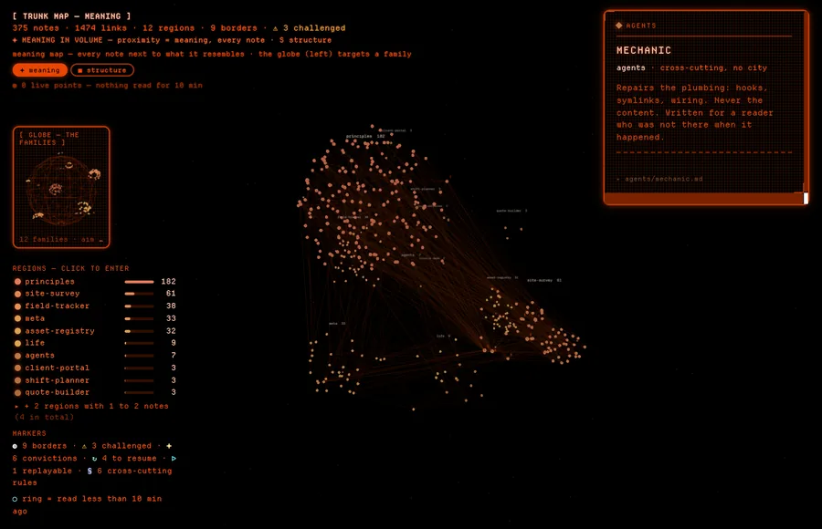
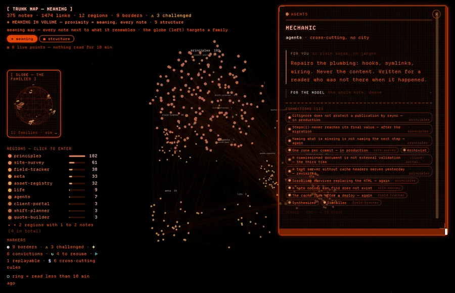

# The planet

A three-dimensional map of everything your trunk knows. Every point is a note,
every line a `[[link]]` you wrote.

It is not decoration. It answers three questions no file listing can ask:

- **where am I working right now?** — recently read points warm up, the rest fade;
- **what is related to what, without my having decided it?** — the *meaning* view
  places notes by content similarity, not by folder;
- **what is still hanging?** — notes that were challenged, held as convictions, or
  left open carry a marker.

---

## Launching

```bash
planet/launch.sh          # http://localhost:8765
planet/launch.sh 8770     # another port, if 8765 is taken
```

The launcher rebuilds the graph **before** opening the page, so the map never
shows a stale state. Nothing is stored between launches: close the tab and it all
comes back from the trunk next time.

It announces itself as `📟 Trunk planet — MOTHER signature`. MOTHER is the
phosphor-and-frame look the map wears — the one the ship's terminal wears in
*Alien* — and the launcher names it so you can tell at a glance which face you
are about to get.

---

## The two views, and what each one means

| Key | View | What POSITION means |
|---|---|---|
| — | **meaning** *(what opens)* | **resemblance** — two nearby notes talk about the same thing, even with no link between them |
| `V` | **the globe** | **filing** — region = folder, city = project |

That is why both exist. The meaning map tells you what a note *resembles*; the
globe tells you where you *filed* it. A note alone in its folder but sitting
against five others in the meaning view is a link you have not written yet.

**The meaning map is what opens**, and the globe rides in the left column as a
small instrument: aim a region in it and the same notes light up in the map.
`V` gives the globe the whole screen back when you want to walk the filing
itself. It used to be the other way round — the globe first, the meaning map
behind a key — and the map turned out to be the thing worth landing on.

`Esc` backs out of a region you entered.

---

## Reading a point

- **Colour** is the region: principles, meta, life, agents, projects.
- **The orange halo** is heat — how recently the note was activated. It decays on
  its own; a note never re-read goes dark.
- **The ring** marks notes actually **read** in the last few minutes, not notes the
  recall merely offered. The distinction matters: the first version counted
  everything offered across a whole session and left a third of the map lit
  permanently.

### The markers, beside the point

| Marker | Meaning | Where it comes from |
|---|---|---|
| ⚠ | **challenger verdict** — this note has been contested | the `challenger` agent |
| ✦ | **conviction** — a position held, not a mere fact | curated convictions |
| ↻ | **to resume** — a thread left open in the note | resume markers |
| ▷ | **replayable** — the note carries a 3D capture | an associated `.glb` |

A ▷ blinks softly: **double-click** opens the capture, which you can then turn by
dragging and zoom with the wheel. `Esc` returns to the map.

### Hover, then click — two panels, not one

**Point at a note** and its links light up on the globe, while the panel gives
you three things and stops there: the region it belongs to, its title, and its
summary. Nothing else. Hovering is how you *sweep* — you read one thing and move
on — so the panel stays a size you can read without stopping.

**Click the note** and the same panel opens out: `for you` — the plain-language
section — first, `for the model` — the full note — folded behind it, and
**`connections (N)` at the end**: the other notes this one is wired to, each
labelled with its region when it comes from another part of the map.

Connections used to appear on hover. They made a passing panel long enough to
scroll, under a cursor that was still moving. They are an exploration, not a
label, so they wait for you to decide to stop.

<table>
<tr>
<td width="50%"></td>
<td width="50%"></td>
</tr>
<tr><td><sub>Hover — four lines, and you keep moving.</sub></td>
    <td><sub>Click — the note opens, connections last.</sub></td></tr>
</table>

---

## The top bar

- `◉ N live points` — what is actually being read, over a short window. Falls back
  to zero on its own, deliberately: a counter that never comes down says nothing.
- `◉ live in: …` — the regions the current session is working in.
- `✦ +N notes` — what the trunk has gained.
- `⚠ N challenged` — what the challenger has put in doubt.

---

## What the map cannot do

Written here rather than discovered in use.

- **Links are not occluded.** Lines on the far side are painted over the near
  side. On a dense trunk, nearly one link in two crosses the globe end to end, and
  the grey haze comes from a handful of very large nodes.
- **Stacked family names fade instead of merging.** Family labels are placed in
  3D, so two clusters far apart in *depth* but lined up with the camera used to
  print their names on top of each other — an illegible blob in the middle of the
  view, worst on a young trunk where the clusters are still small and packed. The
  nearest name now stays readable and the ones it covers drop to a faint ghost:
  enough to tell you something is there, turn the view and it comes back. Nothing
  is moved, so a name never drifts away from the cluster it belongs to.
- **One region can crush the others.** If most of your knowledge is in
  cross-cutting lessons, that region will weigh half the map and the colour code
  will lose its force.
- **Very small regions fade out.** A region holding one or two notes takes up a
  legend colour for almost nothing; that is accepted.
- **The *meaning* view is a rearranged cloud**, not clean clusters. Short notes
  resemble each other too much to separate sharply. The value is in the
  rearrangement — the unexpected neighbours — not in the beauty of the clusters.

---

## Where the data comes from

| File | What it carries |
|---|---|
| `planet/index.html` | the whole map: rendering, views, panels |
| `hooks/graph_export.py` | builds the graph from the trunk, on every launch |
| `hooks/coactivation.py` | heat and the current session |

No planet `.json` ships with the package: they would carry the text of your notes.
They are rebuilt at launch, on your machine, and never leave it.
